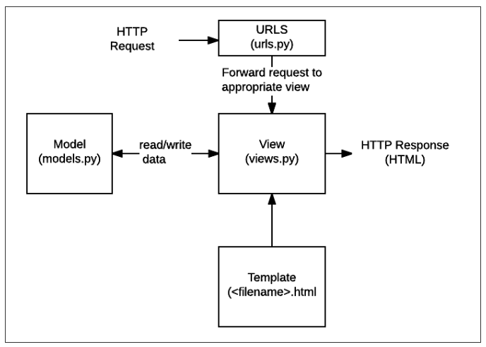

## 1. 프로젝트 만들기

```bash
$ django-admin startproejct 플젝이름 : 프로젝트 생성 명렁어
```

```bash
$ python manage.py runserver 서버구동
```


## 2. 어플리케이션 만들기

> **일반적으로 app 이름은 `복수형`으로 작성 하는 것을 권장**

```bash
$ python manage.py startapp 어플리케이션이름(복수형으로)
```

1. `admin.py`

   > 관리자 페이지

2. **`models.py`**

   > 앱에서 사용하는 Model(Database)를 정의하는 곳.

3. **`views.py`**

   > 중간 관리자 역할.


## 3. 초기설정

1. `setting.py`

   > 웹사이트의 모든 설정 포함, 어플리케이션이 등록되고 파일들의 위치, DB의 세부 사항 보안 등

   1. 앱을 생성하면 앱이랑 플젝이 동일선상에 만들어져있음. 하나의 프로젝트는 여러 어플리케이션을 가지고 있는데 장고는 어플리케이션이 만들어져도 프로젝트 입장에서는 어플리케이션이 만들어졌는지 알수가 없어서 프로젝트에 **등록**해주는 작업 필요.

      - `INSTALLED_APPS`에 있는 건 장고가 구동되는데 기본적으로 필요한 앱들임.

      - 어플리케이션 이름을 등록시켜주면 된다.

        ```python
        # settings.py
        
        INSTALLED_APPS = [
        	'articles', <-- 내가 만든 어플리케이션 이름 넣어주기
            'django.contrib.admin',
            'django.contrib.auth',
            'django.contrib.contenttypes',
            'django.contrib.sessions',
            'django.contrib.messages',
            'django.contrib.staticfiles',
        ]
        ```

        >**INSTALLED_APPS의 app order**
        >
        >```python
        >INSTALLED_APPS = [
        > # 1. local apps
        > 'articles',
        >
        > # 2. Third party apps
        > 'haystack',
        >
        > # 3. Django apps
        > 'django.contrib.admin',
        > 'django.contrib.auth',
        > 'django.contrib.contenttypes',
        > 'django.contrib.sessions',
        > 'django.contrib.sites',
        >]
        >```
      
   2. 언어, 시간 바꾸기
   
       ```python
       LANGUAGE_CODE = 'ko-kr'

       TIME_ZONE = 'Asia/Seoul'
       ```

2. **`urls.py`**

	> 사용자의 요청을 가장 먼저 만나는 곳. 사이트의 내부  연결 지정
	
	

---


**MTV 패턴**

 

**model**

- 응용프로그램의 데이터 구조를 정의하고 데이터베이스의 기록을 관리(추가, 수정, 삭제)

**template**

- 파일의 구조나 레이아웃을 정의
- 실제 내용을 보여주는 데 사용 (presentation)

**view**

- HTTP 요청을 수신하고 HTTP 응답을 반환
- Model을 통해 요청을 충족시키는데 필요한 데이터에 접근
- 그리고 탬플릿에게 응답의 서식 설정을 맡김


---


