## 1. 프로젝트 만들기

```bash
$ django-admin startproejct 플젝이름 : 프로젝트 생성 명렁어
```

```bash
$ python manage.py runserver 서버구동
```


## 2. 어플리케이션 만들기

> **일반적으로 app 이름은 `복수형`으로 작성 하는 것을 권장**

```bash
$ python manage.py startapp 어플리케이션이름(복수형으로) - articles
```

1. `admin.py`

   > 관리자 페이지

2. **`models.py`**

   > 앱에서 사용하는 Model(Database)를 정의하는 곳.

3. **`views.py`**

   > 중간 관리자 역할.


## 3. 초기설정

1. `setting.py`

   > 웹사이트의 모든 설정 포함, 어플리케이션이 등록되고 파일들의 위치, DB의 세부 사항 보안 등

   1. 앱을 생성하면 앱이랑 플젝이 동일선상에 만들어져있음. 하나의 프로젝트는 여러 어플리케이션을 가지고 있는데 장고는 어플리케이션이 만들어져도 프로젝트 입장에서는 어플리케이션이 만들어졌는지 알수가 없어서 프로젝트에 **등록**해주는 작업 필요.

      - `INSTALLED_APPS`에 있는 건 장고가 구동되는데 기본적으로 필요한 앱들임.

      - 어플리케이션 이름을 등록시켜주면 된다.

        ```python
        # settings.py
        
        INSTALLED_APPS = [
        	'articles', <-- 내가 만든 어플리케이션 이름 넣어주기
            'django.contrib.admin',
            'django.contrib.auth',
            'django.contrib.contenttypes',
            'django.contrib.sessions',
            'django.contrib.messages',
            'django.contrib.staticfiles',
        ]
        ```

        >**INSTALLED_APPS의 app order**
        >
        >```python
        >INSTALLED_APPS = [
        >    
        >    # 1. local apps
        >    'articles',
        >
        >    # 2. Third party apps
        >    'haystack',
        >
        >    # 3. Django apps
        >    'django.contrib.admin',
        >    'django.contrib.auth',
        >    'django.contrib.contenttypes',
        >    'django.contrib.sessions',
        >    'django.contrib.sites',
        >
        >]
        >```
      
   2. 언어, 시간 바꾸기

       ```python
       LANGUAGE_CODE = 'ko-kr'

       TIME_ZONE = 'Asia/Seoul'
       ```

2. **`urls.py`**

	> 사용자의 요청을 가장 먼저 만나는 곳. 사이트의 내부  연결 지정
	


<span style="color:red">**APP의 이름은 복수형으로**</span>

<span style="color:red">**APP 생성 후 등록** = startapp으로 app 만든 다음에 setting에 추가!!</span>


---


## MTV 패턴

 

**model**

- 응용프로그램의 데이터 구조를 정의하고 데이터베이스의 기록을 관리(추가, 수정, 삭제)

**template**

- 파일의 구조나 레이아웃을 정의
- 실제 내용을 보여주는 데 사용 (presentation)

**view**

- HTTP 요청을 수신하고 HTTP 응답을 반환
- Model을 통해 요청을 충족시키는데 필요한 데이터에 접근
- 그리고 탬플릿에게 응답의 서식 설정을 맡김


---


## 요청과 응답

> **서버가 구동이 되었으니까 이제 요청과 응답의 사이클 진행**


1. **`urls.py`**

   * 요청을 가장 먼저 받는 곳

   * 요청을 알맞은 `views.py`의 함수로 전달 해줘야함

   ```python
   # urls.py
   
   from django.contrib import admin
   from django.urls import path
   from articles import views - 다른 위치에 있으니까 경로도 알려주기
   
   urlpatterns = [
       path('admin/', admin.site.urls),
       path('index/', views.index),
   ]
   ```

   1. `'admin/'` 얘는 주소를 의미.  

      서버를 켜서 주소 뒤에 `/admin`이라고 넣어주면 해당 페이지로 이동

   2. 메인 페이지의 주소는 일반적으로 `index` 라고 지정.

   3. `\path`의 두번째 인자는 만약 url주소가 index로 요청이 들어왔을 때, 어떤 view 함수를 실행시킬건지? 

      따라서 메인 페이지를 보여주는 views.py 에 있는 함수를 호출을 할거고 그 함수가 지금 views에 없으니까 views.py로 이동해서 함수 만들어주기. (index라는 함수를 만들어줄 예정)

   4. 만들어진 함수 이름을 두번째 인자로 넣기 (`views.index`)

       = views 안에 있는 인덱스라는 함수로 연결

      (다른 위치에 있으니까 경로도 알려주기 - `from articles import views`)

      

      ***사용자의 요청이 index라는 주소값으로 들어온다면 urls.py가 그 url을 인식해서 views.index이걸 호출할거야 라는 의미***

      

2. **`views.py`**

   * HTTP 요청을 수신하고 HTTP 응답을 반환하는 함수 작성

   ```python
   # views.py
   
   from django.shortcuts import render
   
   def index(request): # view 함수의 첫번째 인자는 반드시 request
       return render(request, 'index.html') # 랜더도 request 첫번째 인자로 무조건!
   ```

   1. `urls.py`에서 index라는 주소가 들어왔고 views.py에 있는 index라는 함수와 연결했음.

   2. 어디 사이트를 들어가던 우리가 보는 것은 결국 html문서 하나. 따라서 views에 있는 함수가 데이터들을 조합해 하나의 완성된 템플릿을 만들어야하는데 조합할 데이터가 없으니까 하나의 문서를 보여주고 싶다.(html이 필요하다는 의미)  = `render` : 잘 포장해서 보여줄게, 

   3. `return`의 두번째 인자로는 **우리가 보여줄 페이지가 작성될 템플릿 경로 작성**

      템플릿이 없으니까 템플릿 만들어주러 가야함.

   4. 만들고 와서 장고는 templates라는 경로는 이미 알고있어서 templates라는 폴더 하위에 있는 것들만 두번째 인자로 넣어주면 됨. ex) `'index.html'`

   

3. **`'templates/~~~~~~~.html'`**

   * `views.py`에서 지정한 `index.html` 파일을 만들기
   * Django에서 template이라고 부르는 HTML 파일은 기본적으로 **app 폴더안의 templates 폴더 안에 위치**한다. 
   * 꼭 **`s`** 붙이기!!
   * 화면에 표시될 내용 적기

   ```html
   # index.html
   # ! + tab => 자동완성
   
   <!DOCTYPE html>
   <html lang="en">
   <head>
     <meta charset="UTF-8">
     <meta http-equiv="X-UA-Compatible" content="IE=edge">
     <meta name="viewport" content="width=device-width, initial-scale=1.0">
     <title>Document</title>
   </head>
   <body>
     <h1>만나서 반가워요</h1>
     <a href="/greeting/">greeting</a>
     <a href="/dinner/">dinner</a>
   </body>
   </html>
   ```

    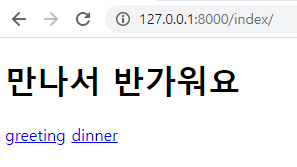

---


## DTL

>  Django Template Language 
>
> 장고 템플릿 내부에서 사용하는 언어
>
> https://docs.djangoproject.com/en/3.1/ref/templates/language/


* Variable

  * **{{ variable }}**
  * render()를 이용해서 views.py에서 정의한 변수를 template 파일로 넘겨줌
  * dot(.)를 사용해서 변수 속성에 접근
  * 딕셔너리 형태로 넘겨주며, key에 해당하는 문자열이 template에서 사용 가능한 변수명이 된다.

  ```python
  # views.py
  
  from django.shortcuts import render
  
  def greeting(request):
      # greeting.html을 보여줄거다.
  
      # 템플릿에서 변수가 출력되기 위해서는 템플릿에 변수가 전달되어야함. 
      # 세번째 인자로 전달
      # 즉 greeting.html에 context에 들어있는거 전달.(딕셔너리)
      
      foods = ['a','b','c','d','e',]
      info = {
          'name':'Harry'
      }
      context = {
          'info' : info,
          'foods' : foods,
      }
      return render(request, 'greeting.html', context)
  ```

  ```django
  # 'greeting.html'
  
  <!DOCTYPE html>
  <html lang="en">
  <head>
    <meta charset="UTF-8">
    <meta http-equiv="X-UA-Compatible" content="IE=edge">
    <meta name="viewport" content="width=device-width, initial-scale=1.0">
    <title>Document</title>
  </head>
  <body>
    
    <h1>안녕하세요 저는 {{ info.name }} 입니다. </h1> - info라는 딕셔너리 안에 name이라는 키 값 존재
    
    <p>제가 좋아하는 음식은 {{ foods }}입니다.</p> - 리스트 그대로 넘어옴 
    
    <p>제가 가장 좋아하는 음식은 {{ foods.0 }}입니다.</p> - 인덱스로 접근
  </body>
  </html>
  ```

   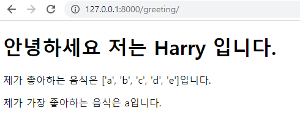

* Filter

  * **{{ variable|filter }}**

  * 수정하기 위해서 사용

    ex) {{ name|lower }} name이라는 변수를 모두 소문자로 출력

    ​		built-in template filter라는 문서에서 확인 가능

  ```python
  # views.py
  
  from django.shortcuts import render
  
  def dinner(request):
      foods=['족발','피자','햄버거','치킨']
      pick=random.choice(foods)
      context = {
          'pick':pick,
          'foods': foods,
      }
      return render(request, 'dinner.html', context)
  ```

  ```django
  # 'dinner.html'
  
  <!DOCTYPE html>
  <html lang="en">
  <head>
    <meta charset="UTF-8">
    <meta http-equiv="X-UA-Compatible" content="IE=edge">
    <meta name="viewport" content="width=device-width, initial-scale=1.0">
    <title>Document</title>
  </head>
  <body>
    <h1>오늘 저녁은 {{ pick }}</h1>
    <p>{{ pick }}은 {{ pick|length }}글자</p>
  </body>
  </html>
  ```

  django built in filters라고 검색하면 많음

  https://docs.djangoproject.com/ko/3.1/ref/templates/builtins/#built-in-template-tags-and-filters

  

* Tags

  * **{ % tag % }**
  * 출력 텍스트를 만들거나, 반복 또는 논리를 수행하여 제어 흐름을 만드는 등 변수보다 복잡한 일들을 수행

  ```django
  # dinner.html
  
     tag 쓰기 
  
    <p>메뉴판</p>
    <ul>
        - 얘는 tag
        <li>{{ food }}</li> - 얘는 변수 
      
    </ul>
  
  ```

  

* Comments

  * **{ # ~~~~~~~~ # }**
  * django template에서 줄의 **주석**을 표현하기 위해 사용
  * 여러 줄 주석은 **~~~~** 사이에 입력
  
  ```django
  # dinner.html
  
    {# 이것은 주석입니다 #}
    
      <p>1</p>
      <p>2</p>
      <p>3</p>
    
  ```
  
   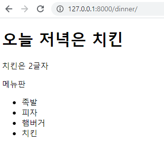

---


## Template Inheritance

* 템플릿 상속은 기본적으로 코드의 재사용성에 초점을 맞춤

* 템플릿 상속을 사용하면 사이트의 모든 공통 요소를 포함하고, 하위 템플릿이 재정의(override) 할 수있는 블록을 정의하는 기본 “skeleton” 템플릿을 만들 수 있음

* 지금까지는 html을 앱에 작성했는데 베이스라는건 모든 앱에도 다 적용되길 원하니까 앱이 들고있는거보다는 프로젝트가 들고있는게 더 효율적

* 따라서 프로젝트에 templates라는 폴더 만들어서 `base.html `만들어주기.

  ```django
  # firstpjt/base.html
  
  <!DOCTYPE html>
  <html lang="en">
  <head>
    <meta charset="UTF-8">
    <meta http-equiv="X-UA-Compatible" content="IE=edge">
    <meta name="viewport" content="width=device-width, initial-scale=1.0">
    <link href="https://cdn.jsdelivr.net/npm/bootstrap@5.0.0-beta2/dist/css/bootstrap.min.css" rel="stylesheet" integrity="sha384-BmbxuPwQa2lc/FVzBcNJ7UAyJxM6wuqIj61tLrc4wSX0szH/Ev+nYRRuWlolflfl" crossorigin="anonymous">
    <title>Document</title>
  </head>
  <body>
    <nav class="navbar navbar-light bg-light">
      <div class="container-fluid">
        <a class="navbar-brand" href="#">Navbar</a>
      </div>
    </nav>
  
    <div class="container">
      
      	자식 템플릿은 이 안에서 작성하면됨
        
    </div>
  
    <script src="https://cdn.jsdelivr.net/npm/bootstrap@5.0.0-beta2/dist/js/bootstrap.bundle.min.js" integrity="sha384-b5kHyXgcpbZJO/tY9Ul7kGkf1S0CWuKcCD38l8YkeH8z8QjE0GmW1gYU5S9FOnJ0" crossorigin="anonymous"></script>
  </body>
  </html>
  ```

  * `block` + `tab`  : 이 부분을 자식에게 넣어줌. 자식 템플릿은 필요한 부분만 가져가면 되니까 블럭에도 이름을 만들어준다. 여기선 content

  * https://getbootstrap.com/docs/5.0/getting-started/introduction/

    부트스트랩 cdn 들고오기 css랑 js

  ```django
  # index.html
  # 위의 index.html이 base.html을 상속 받아오면서 이렇게 변함.
  # 이건 코드 맨 위에서 정의되어야 함
  
  
  
  
    <h1>만나서 반가워요</h1>
    <a href="/greeting/">greeting</a>
    <a href="/dinner/">dinner</a>
  
  ```

  *근데 templates 뒤에 경로를 이미 알고있다는 건 app_name/templates/이 뒤의 경로를 알고 있는거여서 base.html은 프로젝트의 templates 폴더에 F저장되어 있으니까 django가 경로를 알지를 못함.* -> 새로운 경로에도 templates가  있다는 것을 알려줘야함 -> settings.py로 이동

  ```python
  # settings.py
  
  TEMPLATES = [
      {
          ...,
          'DIRS': [BASE_DIR / 'firstpjt' / 'templates'],
  ...				
  ]
  ```

   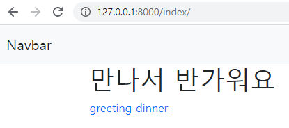

* **`extends` tag**

  - 자식(하위)템플릿이 부모 템플릿을 확장한다는 것을 알림
  - 반드시 템플릿 **최상단**에 위치해야 함(== 템플릿의 첫번째 템플릿 태그여야 함)
    - 즉, 2개 이상 사용할 수 없음

  

* **`block` tag**

  - 하위 템플릿에서 재지정(overriden)할 수 있는 블록을 정의

  - 하위 템플릿이 채울 수 있는 공간

  - 가독성을 높이기 위해 선택적으로 `` 태그에 이름 지정

    ```django
    
    
    ```

  

---


## HTML form

**HTML `<form>` element**

- 웹에서 사용자 정보를 입력하는 여러 방식(text, button, checkbox, file, hidden, image, password, radio, reset, submit)을 제공하고, 사용자로부터 할당된 데이터를 서버로 전송하는 역할을 담당
- 핵심 속성
  - action : 입력 데이터가 전송될 URL 지정 = 어디로?
  - method : 입력 데이터 전달 방식 지정 


**HTML `<input>` element**

* 사용자로부터 데이터를 입력 받기 위해 사용
* `type` 속성에 따라 동작 방식이 달라짐
* 핵심 속성
  - **name**
  - 중복 가능, 양식을 제출했을 때 name이라는 이름에 설정된 값을 넘겨서 값을 가져올 수 있음
  - 주요 용도는 GET/POST 방식으로 서버에 전달하는 파라미터**(name 은 key , value 는 value)**로 `?key=value&key=value` 형태로 전달


---


## HTTP request methods

**GET**

- 검색은 결국 결과를 얻고 싶은거 
- 서버로부터 **정보를 조회**하는 데 사용
- 데이터를 가져올 때만 사용해야 함
- 데이터를 서버로 전송할 때 body가 아닌 **Query String Parameters**를 통해 전송


---

**예시문제 - throw & catch** 

이제부터 할건 데이터를 보내고 서버에서 데이터 받고 그 받은걸 다시 그대로 넘겨주기!!

예를들어 안녕이라고 보내면 장고가 안녕을 받아서 다른 페이지에 안녕을 보여주기


<작성 순서>

1. urls.py 부터 작성.

2. view 함수는 데이터 받을 템플릿 출력하는 함수,  앞에서 만들어진 데이터를 (보내진 데이터) 받는 함수. 그래서 form 태그가 있는 즉 데이터를 받는 템플릿 하나 결과를 보여줄 템플릿 하나

   *즉 함수도 두개 템플릿도 두개 필요!!*

   

**데이터 받을 템플릿 출력하는 함수 = throw** 

1. urls.py

   > 프로젝트 폴더의 urls.py로 이동

   보내는거 만들기

   ```python
   # urls.py
   
   from django.contrib import admin
   from django.urls import path
   from articles import views
   
   urlpatterns = [
       path('throw/', views.throw),
   ]
   ```

2. articles/views.py

   > 앱 폴더의 views.py로 이동

   ```python
   # views.py
   # 사용자한테 입력을 받을 템플릿을 출력해주는 애. 그냥 템플릿으로 이동하게만 만들어주면 될 듯?
   
   from django.shortcuts import render
   
   def throw(requset):
       return render(request, 'throw.html')
   ```

3. articles/templates/throw.html

   ```django
   사용자의 데이터를 받고 전송하기 위해서는 HTML의 form 태그가 그 역할을 해주니까 form태그 넣어주기.
   
   
   
   
   
     <h1>THROW</h1>
     사용자의 데이터를 받고 전송
     method는 필수인데 디폴트는 get이지만 명시해주기 action : 캐치로 보낸다. 주소 넣어주기
     <form action="/catch/" method='GET'>
       라벨태그는 id와 연결
       <label for="message">Throw: </label>
   	사용자의 입력을 받는 태그
       여기에 입력하는 값은 value 인데 서버의 입장에선 value에 바로 접근할 수 없으니까 name=key값을 줘야한다. 꼭!!
       <input type="text" name='message' id='message'>
       제출 하기 만들기 (제출하기는 form의 바깥쪽에 있으면 안됨.)
       <input type="submit">
     </form>
   
   
   
   ```

    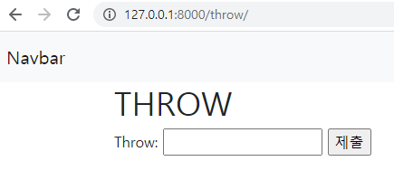 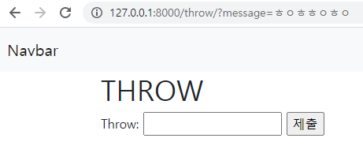

   입력을 하고 제출을 하면 위의 주소값이 바뀜. 내가 name을 message로 줬으니까
    http://127.0.0.1:8000/throw/?message=ㅎㅇㅎㅎㅇㅎㅇ 이런식!
   보낼 주소가 없기때문에 페이지가 전환이 되진 않음
   ==> 데이터를 받아서 보낼 view는 완성.

   ​		보내진 데이터를 다시 받아서 클라이언트로 보낼 view 필요! (catch)

   

**보내진 데이터를 다시 받아서 클라이언트로 보낼 view 필요! (catch)**

1. urls.py

   > 프로젝트 폴더의 urls.py로 이동

   보내는거 만들기

   ```python
   # urls.py
   
   urlpatterns = [
       path('catch/', views.catch),
   ]
   ```

2. articles/views.py

   > 앱 폴더의 views.py로 이동

   ```python
   # views.py
   # 얘는 throw에서 보낸 데이터를 받아서 catch에서 출력을 해줘야함
   # request의 GET에 접근을 해야 아까 제출한거에 접근 가능
   
   def catch(request):
       message = request.GET
       print(message) -> <QueryDict: {'message': ['안녕']}> 이런식으로 나옴
       ---------------------- 따라서 안녕까지 접근을 해야하니까 위처럼 쓰지 말고 딕셔너리니까 get(key)쓰기---
       message = request.GET.get('message')
       # 즉 request에 있는 GET에 딕셔너리가 하나 있는데 그 값이 message인 값을 가져오기 그래서 이걸 context에 담아서 catch.html에 넘겨주기
           context = {
           'message':message,
       }
       return render(request, 'catch.html', context)
   ```

3. articles/templates/catch.html

   ```django
   
   
   
     <h1>CATCH</h1>
     <h2>{{ message }}도착 완료</h2>
   
   ```

    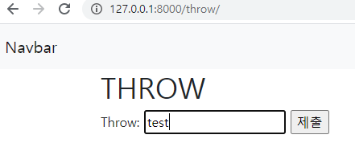 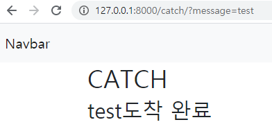


---

<span style="color:blue">**파일바꾸기**</span>

## URLs

> 웹 어플리케이션은 URL을 통한 클라이언트의 요청에서부터 시작


### URL mapping

만약 앱에 뷰함수가 많아지만 path가 늘어날텐데, 앱 또한 많아진다면 프로젝트의 urls.py에서 모든걸 다 관리하기는 쫌 문제

따라서 각 app에 urls.py를 만들어줄거임. 각 앱이 자기의 url을 가져가도록!

```bash
$ python manage.py startapp pages
```

```
# articles, pages : app
# firstpjt : 플젝이름

articles/
	urls.py
	views.py
pages/
	urls.py
	views.py
firstpjt/
	urls.py
	settings.py
```

 이렇게 앱(pages)을 하나 더 만들어줬으면 setting.py에 가서 pages 추가, 

```python
INSTALLED_APPS = [
    'articles',
    'pages',
    ...,
]
```

 firstpjt/urls.py에 들어가서 `from pages import views` 얘를 추가해주려고 보니까 `from articles import views`이미 얘가 존재하는중.. 그래서 이렇게 하지말고 저거 두개 views.py에서 지우고

```python
# firstpjt/urls.py
# 이거만 남은 상태
# 어드민만 남겨놓고 원래 있던 path들은 예전에 있던 articles로 다 옮겨줌

from django.contrib import admin
from django.urls import path

urlpatterns = [
    # 'admin/' 얘는 주소를 의미. 서버를 켜서 주소 뒤에 /admin이라고 넣어주면 해당 페이지로 이동
    path('admin/', admin.site.urls),   
]
```

앱들의 urls.py에 들어가서

```python
# articles/urls.py

from django.urls import path
from . import views - 같은 위치에 있으니까 현재 디렉토리에서 views.py를 가져올거야

urlpatterns = [
    path('index/', views.index),
    path('greeting/', views.greeting),
    path('dinner/', views.dinner),
    path('throw/', views.throw),
    path('catch/', views.catch),
]
```

```python
# pages/urls.py

from django.urls import path

urlpatterns=[
    
]
```

그럼 지금 firstpjt/urls.py - articles/urls.py

​											- pages/urls.py  이렇게 두개로 나뉨

여기서 프로젝트의 url의 역할은 처음 요청이 들어왔을때 articles로 보낼지, pages로 보낼지를 판단해주는거!

따라서 마지막으로 이런식으로 수정해야한다.

**`include()`**

- 다른 URLconf(app1/urls.py)들을 참조할 수 있도록 도움
- 함수 include()를 만나게 되면, URL의 그 시점까지 일치하는 부분을 잘라내고, 남은 문자열 부분을 후속 처리를 위해 include된 URLconf로 전달

```python
# firstpjt/urls.py
# 이거만 남은 상태
# 어드민만 남겨놓고 원래 있던 path들은 예전에 있던 articles로 다 옮겨줌

from django.contrib import admin
from django.urls import path,include

urlpatterns = [
    # 'admin/' 얘는 주소를 의미. 서버를 켜서 주소 뒤에 /admin이라고 넣어주면 해당 페이지로 이동
    path('admin/', admin.site.urls),
    # 일반적으로 주소는 그 앱의 이름으로 함
    # url이 articles로 시작하는 url로 들어오면 articles/url로 넘어가야함. = include 추가
    path('articles/', include('articles.urls')),
    path('pages/', include('pages.urls')),
]
```

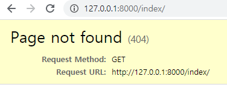 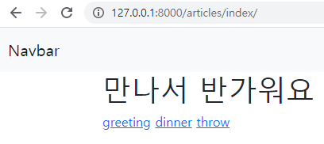

이렇게 url을 분리시켜 줬으니까 바로 index라고 하면 안되고 articles에 index라는 함수를 넣어줬으니까 articles/index라고 접근해야함.
articles : firstpjt/urls.py에서 판단해서 articles/urls.py로 보내야겠다!!
index : articles(app)로 옮겨가서 그 안에서 매칭되는 index함수 찾기


### Variable routing

- 동적 라우팅
  
  - 사용자의 입력을 통해 계속 바뀌는 걸 만들고 싶음
  - 주소 자체를 변수처럼 사용해서 동적으로 주소를 만드는 것]
  
  ```python
  # articles/urls.py
  
  urlpatterns = [
      ...,
      # <> : 주소의 이 부분을 마음대로 바꿀 수 있다. 단 타입이 str
      path('hello/<str:name>/', views.hello),
  ]
  ```
  
  ```python
  # articles/views.py
  
  # 동적 변수 name이 두번째 인자로 들어옴
  def hello(request, name):
      context = {
          'name': name,
      }
      return render(request, 'hello.html', context)
  ```
  
  ```django
  <!-- articles/hello.html -->
  
  
  
  
    <h1>만나서 반가워요 {{ name }}님!</h1>
  
  ```
  
   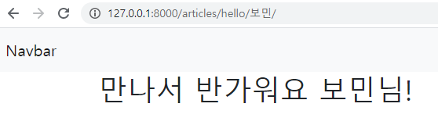

	### Naming URL patterns

* Django는 URL에 이름을 지정하는 방법을 제공하므로써 뷰 함수와 템플릿에서 특정 주소를 쉽게 참조할 수 있도록 도움

앱을 분리한 상태임. 
근데 index페이지에서 greeting페이지로 넘어가기 위해 클릭을 하면 원래 `<a href="/greeting/">greeting</a>`이런식으로 a태그가 들어있어서 greeting을 찾아가야하는데 articles/greeting에 이렇게 들어가야하니까 안됨. 
그래서 greeting의 html로 들어가서 action을 'articles/greeting'으로 바꾸고, index의 a태그를 또 '/articles/greeting/'이렇게 바꿔야 하는데 너무 많음. - 하드코딩

그래서 **처음에 작성할 때부터 urls.py에서 path에 이름을 정해줘서** `<a href="">greeting</a>` 이렇게 이름으로 넘겨주면 이동 가능


```python
# articles/urls.py

urlpatterns = [
    path('index/', views.index, name='index'),
    path('greeting/', views.greeting, name='greeting'),
    path('dinner/', views.dinner, name='dinner'),
    path('throw/', views.throw, name='throw'),
    path('catch/', views.catch, name='catch'),
    path('hello/<str:name>/', views.hello, name='hello'),
]
```

**url tag 사용하기**

```django
<!-- index.html -->




  <h1>만나서 반가워요!</h1>
  <a href="">greeting</a>
  <a href="">dinner</a>
  <a href="">throw</a>

```


그럼 만약에 두번째 앱에서도 greeting이 필요할땐 어떻게해??

이런거 방지하기 위해서 

app이름/templates/**app이름** 이렇게해서 폴더구조 만들어 준 다음에 마지막에 html 추가해주기.

근데 경로가 바뀌었으니까 views.py에 들어가서

```python
# pages/views.py

def index(request):
    return render(request, 'pages/index.html') <- 이런식으로 경로 바꿔주기
```

 

그 다음에 또, 만약 articles의 메인페이지에 `Pages의 Index 페이지로 이동하기`라는 버튼을 하나 만들었을 때,  `<a href="">Pages의 Index 페이지로 이동하기</a>`이렇게 작성했다치면, index함수는 articles에도 있고 pages에도 있음. 구분이 안되는 상태.

**그래서 어떤 앱에 있는 url을 뜻하는건지 구분 필요**

==> 각 app들의 urls.py로 들어가서 urlpatterns 위에  `app_name ='pages' `적어준 다음에 각 path에 있는 name들도 수정해줌.

*수정해줘야할것들*

```python
# pages/urls.py

from django.urls import path
from . import views

app_name = 'pages'
urlpatterns=[
    path('index/', views.index, name = 'index')
]
```

```python
# articles/urls.py

app_name = 'articles' 추가
```

URL 태그 있는 곳들 다 이름표 붙여주기??

```django
# articles/templates/articles/index.html
# 이름표 다 달아주기




  <h1>만나서 반가워요</h1>
  <a href="">greeting</a>
  <a href="">dinner</a>
  <a href="">throw</a>
  <hr>
  <a href="">Pages의 Index 페이지로 이동하기</a>

```


---


# Model

> 웹 어플리케이션의 데이터를 구조화하고 조작하기 위한 도구

**개념**

- 모델은 단일한 데이터에 대한 정보를 가짐
- 일반적으로 각각의 **모델(클래스)**는 하나의 데이터베이스 **테이블과 매핑**
- 모델은 부가적인 메타데이터를 가진 **DB의 구조(layout)를 의미**

<br>

### Database

> 체계화된 데이터의 모임 (집합)

**기본 구조**

- `쿼리(Query)`
  - 데이터를 조회하기 위한 명령어
  - (주로 테이블형 자료구조에서) 조건에 맞는 데이터를 추출하거나 조작하는 명령어
- `스키마 (Schema)` —> 뼈대(Structure)
  - 데이터베이스에서 자료의 구조, 표현 방법, 관계 등을 정의한 구조
  - 데이터베이스 관리 시스템(DBMS)이 주어진 설정에 따라 데이터베이스 스키마를 생성하며, 데이터베이스 사용자가 자료를 저장, 조회, 삭제, 변경할 때 DBMS는 자신이 생성한 데이터베이스 스키마를 참조하여 명령을 수행
- `테이블 (Table)` —> 관계(Relation) —> 엑셀의 sheet
  - 필드(field) : 속성, 컬럼(Column)
    - 모델 안에 정의한 클래스에서 클래스 변수가 필드가 됨
  - 레코드(record) : 튜플, 행(Row)
    - 우리가 ORM을 통해 해당하는 필드에 넣은 데이터(값)


### ORM

> 객체-관계 매핑

**개념**

- 객체 지향 프로그래밍 언어를 사용하여 호환되지 않는 유형의 시스템간에(Django - SQL)데이터를 변환하는 프로그래밍 기술
- OOP 프로그래밍에서 RDBMS을 연동할 때, 데이터베이스와 객체 지향 프로그래밍 언어 간의 호환되지 않는 데이터를 변환하는 프로그래밍 기법이다. 
- Django는 내장 Django ORM을 사용


**장/단점**

- 장점
  - SQL을 몰라도 DB 연동이 가능하다. (SQL 문법을 몰라도 쿼리 조작 가능)
  - SQL의 절차적인 접근이 아닌 객체 지향적인 접근으로 인해 `생산성`이 증가한다.
  - ORM은 독립적으로 작성되어 있고, 해당 객체들을 재활용할 수 있다. 
    - 때문에 모델에서 가공된 데이터를 컨트롤러(view)에 의해 뷰(template)과 합쳐지는 형태로 디자인 패턴을 견고하게 다지는데 유리
- 단점
  - ORM 만으로 완전한 서비스를 구현하기 어려운 경우가 있다.
  - 프로젝트의 복잡성이 커질 경우 설계 난이도가 상승할 수 있다.


**정리**

- 객체 지향 프로그래밍에서 DB를 편리하게 관리하게 위해 ORM 프레임워크를 도입
- **"우리는 DB를 객체(object)로 조작하기 위해 ORM을 사용한다."**


**models.py 정의**

```python
# articles/models.py

class Article(models.Model): # Model class 상속
    # id는 기본적으로 처음 테이블 생성시 자동으로 만들어진다.
    title = models.CharField(max_length=10) # 클래스 변수(DB의 필드)
    content = models.TextField() 
```

* title, content = 컬럼명
* 각각의 컬럼은 고유한 형식을 가지고 있으니까 그 형식에 맞는 필드 넣어줘야함.


## Migrations

>  django가 모델에 생긴 **변화(필드를 추가했다던가 모델을 삭제했다던가 등)를 반영**하는 방법


#### makemigrations

> migration 파일은 데이터베이스 스키마를 위한 버전관리 시스템이라 생각하자

- 모델을 변경했으면 그거로 **새로운 설계도**만 만들떄 사용
- 모델을 활성화 하기 전에 DB 설계도(마이그레이션) 작성

```bash
$ python manage.py makemigrations
```

- `0001_initial.py` 생성 확인


#### migrate

> **설계도를 실제 DB에 반영하는 과정**

- `migrate` 는 **`makemigrations` 로 만든 설계도를 실제 `db.sqlite3` DB에 반영**한다.

- 모델에서의 변경 사항들과 DB의 스키마가 동기화를 이룬다.

  ```bash
  $ python manage.py migrate
  ```


#### sqlmigrate

- 해당 migrations 설계도가 **SQL 문으로 어떻게 해석**되어서 동작할지 미리 확인 할 수 있다.

  ```bash
  $ python manage.py sqlmigrate app_name 0001
  ```


#### showmigrations

- migrations 설계도들이 **migrate 됐는지 안됐는지 여부**를 확인 할 수 있다.

  ```bash
  $ python manage.py showmigrations
  ```


**변경사항 반영**

이렇게 수정사항이 생기면 설계도를 다시 만들어야하고(makemigrations) - 만든 설계도를 DB에 반영하고(migrate)

```python
class Article(models.Model):
    title = models.CharField(max_length=10)
    content = models.TextField()
    created_at = models.DateTimeField(auto_now_add=True)
    updated_at = models.DateTimeField(auto_now=True)
```

* `auto_now_add = True`  : 처음 저장될때의 날짜만 저장 = 작성일
* `auto_now = True` : 객체가 저장될때마다 자동적으로 값을 할당 = 수정일

```bash
$ python manage.py makemigrations
```


```bash
You are trying to add the field 'created_at' with 'auto_now_add=True' to article without a default; the database needs something to populate existing rows.

 1) Provide a one-off default now (will be set on all existing rows)
 2) Quit, and let me add a default in models.py
Select an option: 1
```

- `1` 입력 후 enter (추가된 필드에 대한 default 값 설정)


```bash
Please enter the default value now, as valid Python
You can accept the default 'timezone.now' by pressing 'Enter' or you can provide another value.
The datetime and django.utils.timezone modules are available, so you can do e.g. timezone.now
Type 'exit' to exit this prompt
[default: timezone.now] >>>
```

- 그대로 `enter` (django가 timezone.now를 default 함수 값으로 자동 설정)

```bash
$ python manage.py migrate
```


---


**모델링을 한 뒤 수행하는 루틴**


[시작 : 파이썬 언어로 DB 모델링]

1. models.py에 모델을 추가, 수정, 삭제
2. makemigrations : 설계도를 생성
3. migrate : 설계도를 실제 DB에 반영

-showmigrations : 설계도를 만들어서 반영했나 확인

[끝:DB 반영 완료]


----


## Database API

> DB를 조작하기 위한 도구

예를 들어 작성자가 '김철수'인 모든 게시글을 조회해줘 이런느낌?


### DB API 구문

* <span style="color:red">**클래스이름.objects.쿼리셋 API**</span>

* **Article.objects.all()**
* [쿼리 API]https://docs.djangoproject.com/en/3.1/ref/models/querysets/#queryset-api-reference


**Django shell**

- 일반 파이썬 쉘을 통해서는 장고 프로젝트 환경에 접근할 수 없음

- 그래서 장고 프로젝트 설정이 로딩된 파이썬 쉘을 활용

  ```python
  # settings.py
  
  INSTALLED_APPS = [
      ...
      'django_extensions',
      ...
  ]
  ```

  ```bash
  $ python manage.py shell_plus
  ```

  

---


## CRUD

> CREATE, READ, UPDATE, DELETE


### 1. CREATE

 ```bash
$ python manage.py shell_plus
 ```

 

**데이터 객체를 만드는(생성하는) 3가지 방법**

**첫번째 방식**

- ORM을 쓰는 이유는 DB 조작을 객체 지향 프로그래밍(클래스)처럼 하기 위해
  - `article = Article()` :  클래스로부터 인스턴스 생성
  - `article.title` : 해당 인스턴스 변수를 변경
  - `article.save()` : 인스턴스로 메소드를 호출

```python
>>> article = Article() 
>>> article
<Article: Article object (None)>

>>> article.title = 'first' 
>>> article.content = 'django!' 

# save 를 하지 않으면 아직 DB에 값이 저장되지 않음
>>> article
<Article: Article object (None)>

>>> Article.objects.all()                            
<QuerySet []>

# save 를 하고 확인하면 저장된 것을 확인할 수 있다
>>> article.save()
>>> article
<Article: Article object (1)>
>>> Article.objects.all()
<QuerySet [Article: Article object (1)]>

# 인스턴스인 article을 활용하여 변수에 접근해보자
>>> article.title
'first'
>>> article.content
'django!'
```


**두번째 방식**

```python
>>> article = Article(title='second', content='django!!')
>>> article.save()
>>> article
<Article: Article object (2)>
>>> Article.objects.all()
<QuerySet [<Article: Article object (1)>, <Article: Article object (2)>]>

# 값을 확인
>>> article.pk
2
>>> article.title
'second'
>>> article.content
'django!!'
```


**세번째 방식**

- `create()` 를 사용하면 쿼리셋 객체를 생성하고 저장하는 로직이 한번의 스텝으로 가능

```python
>>> Article.objects.create(title='third', content='django!')
<Article: Article object (3)>
```


출력값을 사람 친화적이게 바꾸는 방법!!

```python
# articles/models.py

class Article(models.Model):
    title = models.CharField(max_length=10)
    content = models.TextField()
    created_at = models.DateTimeField(auto_now_add=True)
    updated_at = models.DateTimeField(auto_now=True)

    def __str__(self):  <- 이거 추가해주기 self.title로 받아오니까 title만 보여짐
        return self.title
```

바로 반영이 안되니까 exit 한다음에 python manage.py shell_plus해서 다시 시작. 이때 shell이 다시 시작되면 이전꺼는 알 수가 없음 따라서 Article.objects.get(pk=1) : 기본키가 1인 애를 조회하고싶음.

```
In [1]: Article.objects.get(pk=1)
Out[1]: <Article: first>
```


## 2. READ

1. **`all()`** - 모두 다 조회

   > https://docs.djangoproject.com/en/3.1/ref/models/querysets/#all

   - `QuerySet` return
   - QuerySet은 리스트는 아니지만 리스트와 거의 비슷하게 동작

   ```python
   >>> Article.objects.all() = 모든 데이터 달라.
   <QuerySet [<Article: Article object (1)>, <Article: Article object (2)>, <Article: Article object (3)>, <Article: Article object (4)>]>
   get()
   ```

   

2. **`get()`** - 어떤거 **하나**만 가져오기 , pk 인스턴스 '하나' (유일한 값을 가지는 필드를 기준으로 데이터를 조회)

   >  https://docs.djangoproject.com/en/3.1/ref/models/querysets/#get

   - 객체가 없으면 `DoesNotExist` 에러가 나오고 객체가 여러 개일 경우에 `MultipleObjectReturned` 오류를 띄움.
   - 위와 같은 특징을 가지고 있기 때문에 unique 혹은 Not Null 특징을 가지고 있으면(ex. `pk`) 사용할 수 있다.

   ```python
   >>> article = Article.objects.get(pk=100)
   DoesNotExist: Article matching query does not exist.
   
   >>> Article.objects.get(content='django!')
   MultipleObjectsReturned: get() returned more than one Article -- it returned 2!
   
   ```

   

3. **`filter()`** - 조건에 맞는 것들만 가져오기,  중복 가능성이 있는 필드를 기준으로 데이터 조회

   >  https://docs.djangoproject.com/en/3.1/ref/models/querysets/#filter

   - 지정된 조회 매개 변수와 일치하는 객체를 포함하는 새 QuerySet을 반환

     ```python
     >>> Article.objects.filter(content='django!')
     <QuerySet [<Article: first>, <Article: fourth>]>
     
     >>> Article.objects.filter(title='first')
     <QuerySet [<Article: first>]>
     ```

   

**Field lookups**

> https://docs.djangoproject.com/en/3.1/ref/models/querysets/#field-lookups

- SQL WHERE 절을 지정하는 방법

- QuerySet 메서드 filter(), exclude() 및 get()에 대한 키워드 인수로 지정

  ```python
  Article.objects.filter(pk__gt=1) pk가 1 보다 큰거
  ```

  ```python
  Article.objects.filter(content__contains='내가 찾고 싶은 조건')
  ```

  

**The `pk` lookup shortcut**

> https://docs.djangoproject.com/en/3.1/topics/db/queries/#the-pk-lookup-shortcut

- 또한, 우리가 `.get(id=1)` 형태 뿐만 아니라 `.get(pk=1)` 로 사용할 수 있는 이유는(DB에는 id로 필드 이름이 지정 됨에도) `.get(pk=1)` 이`.get(id__exact=1)` 와 동일한 의미이기 때문이다. 

- pk는 `id__exact` 의 shortcut 이다.

  ```python
  >>> Blog.objects.get(id__exact=14) # Explicit form
  >>> Blog.objects.get(id=14) # __exact is implied
  >>> Blog.objects.get(pk=14) # pk implies id__exact
  ```


## 3. UPDATE

기존에 있던 인스턴스에 접근

```python
>>> article = Article.objects.get(pk=1) 1 번글 접근
>>> article.title
'first'

# 값을 변경하고 저장
>>> article.title = 'byebye'
>>> article.save()

# 정상적으로 변경된 것을 확인
>>> article.title
'byebye'
```


## 4. DELETE

```python
>>> article = Article.objects.get(pk=1)

# 삭제
>>> article.delete()
(1, {'articles.Article': 1})

# 다시 1번 글을 찾으려고 하면 없다고 나온다.
>>> Article.objects.get(pk=1)
DoesNotExist: Article matching query does not exist.
```

* article.delete() 이건 save 안해줘도 그냥 알아서 바뀜

---


## Admin Site

> 사용자가 아닌 서버의 관리자가 활용하기 위한 페이지 

**개념**

- 사용자가 아닌 서버의 관리자가 활용하기 위한 페이지
- Article class를 `admin.py` 에 등록하고 관리
- record 생성 여부 확인에 매우 유용하고 CRUD 로직을 확인하기에 편리하다.


**model 등록**

```python
# articles/admin.py

from django.contrib import admin
from .models import Article - 같은 경로에 있는 models.py에서 Article 클래스 가져오기

admin.site.register(Article) = 어드민 사이트에 등록하겠다.
```


**관리자 생성**

```bash
$ python manage.py createsuperuser
```

- 관리자 계정 생성 후 서버를 실행한 다음 `/admin` 으로 가서 관리자 페이지 로그인

  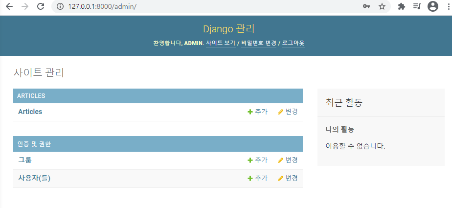

  로그인 하고 나서.

  Articles가 뜨는 이유는 아까 등록을 해서 `admin.site.register(Article)` 요거!!


**admin site확인**

- 바로 `models.py` 에 정의한 `__str__` 의 형태로 객체가 표현된다.

  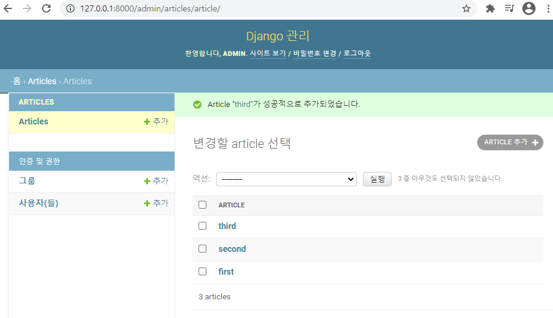

  아까 `articles/models.py`여기에서 def __str__ 여기서 title만 출력하게 해서 이렇게 나옴


**ModelAdmin options**

`list_display`

- admin 페이지에서 우리가 models.py 정의한 각각의 속성(컬럼)들의 값(레코드)를 출력

  ```python
  # articles/admin.py
  
  from django.contrib import admin
  from .models import Article
  
  class ArticleAdmin(admin.ModelAdmin):
      list_display = ('pk', 'title', 'content', 'created_at', 'updated_at',)
  
  admin.site.register(Article, ArticleAdmin)
  ```

  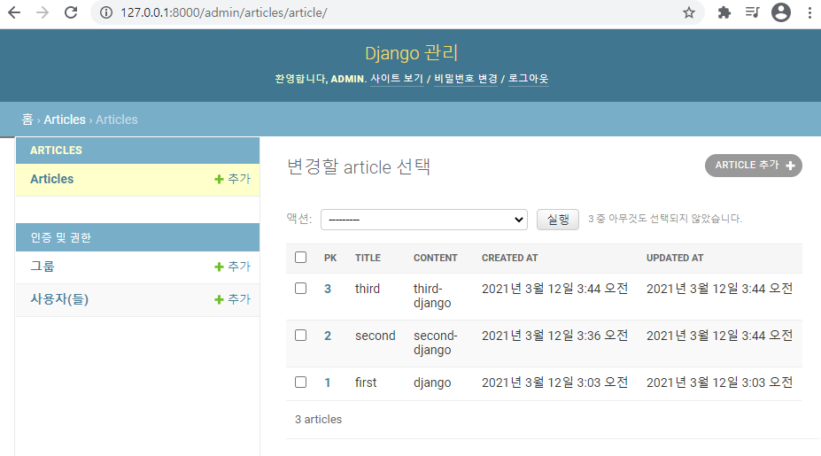

------


## CRUD views.py에서 만들기!


1. 기본 설정

   ```python
   # crud/urls.py
   
   from django.contrib import admin
   from django.urls import path,include
   
   urlpatterns = [
       path('admin/', admin.site.urls),
       path('articles/', include('articles.urls'))
   ]
   ```

   ```python
   # articles/urls.py
   
   from django.urls import path
   from . import views
   
   app_name = 'articles'
   urlpatterns = [
       path('index/', views.index, name='index'),
   ]
   
   ```

   ```python
   # articles/views.py
   
   from django.shortcuts import render
   from .models import Article
   
   # Create your views here.
   def index(request):
       return render(request, 'articles/index.html', context)
   ```

   ```django
   <!-- crud/templates/base.html -->
   
   <!DOCTYPE html>
   <html lang="en">
   <head>
     <meta charset="UTF-8">
     <meta http-equiv="X-UA-Compatible" content="IE=edge">
     <meta name="viewport" content="width=device-width, initial-scale=1.0">
     <link href="https://cdn.jsdelivr.net/npm/bootstrap@5.0.0-beta2/dist/css/bootstrap.min.css" rel="stylesheet" integrity="sha384-BmbxuPwQa2lc/FVzBcNJ7UAyJxM6wuqIj61tLrc4wSX0szH/Ev+nYRRuWlolflfl" crossorigin="anonymous">
     <title>Document</title>
   </head>
   <body>
     <div class="container">
       
       
     </div>
     <script src="https://cdn.jsdelivr.net/npm/bootstrap@5.0.0-beta2/dist/js/bootstrap.bundle.min.js" integrity="sha384-b5kHyXgcpbZJO/tY9Ul7kGkf1S0CWuKcCD38l8YkeH8z8QjE0GmW1gYU5S9FOnJ0" crossorigin="anonymous"></script>
   </body>
   </html>
   ```

   ```python
   # crud/settings.py
   
   'DIRS': [BASE_DIR / 'crud' / 'templates'],
      
   ```

   ```django
   articles/templates/articles/index.html
   이건 그냥 예시
   
   
   
   
     <h1>Articles</h1>
     <hr>
     
       <p>글 번호: {{ article.pk }}</p>
       <p>글 제목: {{ article.title }}</p>
       <p>글 내용: {{ article.content }}</p>
       <hr>
     
   
   
   ```

2. 모델 작성

   ```python
   from django.db import models
   
   # Create your models here.
   class Article(models.Model):
       title = models.CharField(max_length=10)
       content = models.TextField()
       created_at = models.DateTimeField(auto_now_add=True)
       updated_at = models.DateTimeField(auto_now=True)
   
   ```

   저장 꼭 하고!!

   ```bash
   $ python manage.py makemigrations
   ```

   ```bash
   $ python manage.py migrate
   ```

3. 기본 페이지(index) 설정

   ```python
   # articles/urls.py
   
   from django.urls import path
   from . import views
   
   app_name = 'articles'
   urlpatterns = [
       path('', views.index, name='index'),
   ]
   
   
   # articles/views.py
   
   def index(request):
       return render(request, 'articles/index.html')
   ```

   ```django
   <!-- templates/articles/index.html -->
   
   
   
   
     <h1>Articles</h1>
   
   ```

4. 등록해주기

   ```python
   # articles/admin.py
   
   from django.contrib import admin
   from .models import Article - 같은 경로에 있는 models.py에서 Article 클래스 가져오기
   
   admin.site.register(Article) = 어드민 사이트에 등록하겠다.
   ```

5. 관리자계정 만들기

   ```bash
   $ python manage.py createsuperuser
   ```

   우선 로그인해서 글 몇개 빠르게 써주기

   

## READ 

* 인덱스 페이지에 모든 글 다 출력해보기

```python
# articles/views.py
from django.shortcuts import render
from .models import Article

def index(request):
    # - Article얘를 현재 경로의 models에서 가져와야하니까 from .models import Article 추가
    articles = Article.objects.all() 
    context = {
        'articles': articles,
    }
    return render(request, 'articles/index.html', context)
```

```django
<!--templates/articles/index.html-->




  <h1>Articles</h1>
  <hr>
  
    <p>글 번호: {{ article.pk }}</p>
    <p>글 제목: {{ article.title }}</p>
    <p>글 내용: {{ article.content }}</p>
    <hr>
  

```

 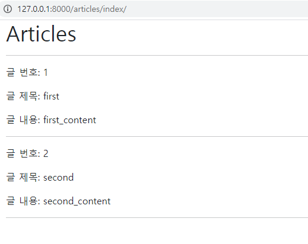

## CREATE

> 사용자로부터 데이터를 받아서 저장해줘야함
>
> 이때는 사용자에게 form 태그를 보여주는 거 한개, 받아가지고 처리해주는거 한개 총 2개


### New - 사용자에게 form 태그 보여주는거.

```python
# articles/urls.py

path('new/', views.new, name='new'),
```

```python
# articles/views.py
# 게시글 쓸 수 있는 페이지(html) 주세요!

def new(request): # 사용자에게 form 태그 보여주는 함수, html에 form 들어갈 듯
    # 사용자한테 전달해줘야할 뭐 데이터 아무것도 없음.
    return render(request, 'articles/new.html')
```

```django
<!-- templates/articles/new.html -->




  <h1>NEW</h1>
	액션은 우리 데이터가 어디로 갈지 정하는거, 메서드는 우리 데이터가 어떤 방식으로 갈지
	get : 주소 뒤에 쿼리 스트링 형식으로 붙는다.
	action : 사용자가 우리가 만든 폼에 무언가를 적고 작성하기를 누르면 action에 적은 주소로 갈거임. 근데 데이터를 받앗어 처리해 줄 함수가 없으니까 만들어 주러 가야힘. 따라서 action에 들어갈 거 만들어주기 = create
  <form action="#" method="GET">
    <label for="title">Title: </label>
    <input type="text" name="title"><br>
    <label for="content">Content: </label>
    <textarea name="content" cols="30" rows="5"></textarea><br>
    <input type="submit">
  </form>
  <hr>
  <a href="">[back]</a>

```

```django
<!-- templates/articles/index.html -->




  <h1>Articles</h1>
  <a href="">[new]</a>
  <hr>

```


### Create - new가 만들어졌을 때 , action이 받을 부분

* 데이터 줄테니까 DB에 데이터 생성 해주세요

```python
# articles/urls.py
# 사용자가 제출하면 여기로 오게끔 할거임.

path('create/', views.create, name='create'),
```

```python
# articles/views.py
# get 요청이 이제 이 함수로 들어올거고(request.GET) 그렇게 들어온 딕셔너리의 value값에 접근(.get('title') )

def create(request):
    title = request.GET.get('title') 
    content = request.GET.get('content')
    # DB에 저장하는거
    article = Article(title=title, content=content)
    article.save()
    
    return render(request, 'articles/create.html')
```

```django
<!-- templates/articles/create.html -->




  <h1>성공적으로 글이 작성되었습니다.</h1>

```

 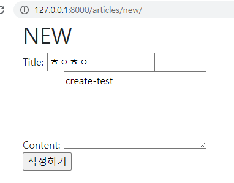 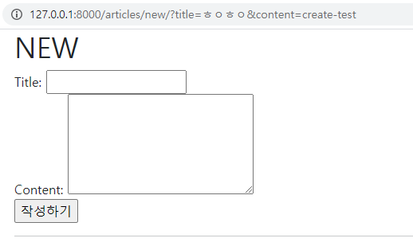

new에 접근해서 저렇게 적고 작성하기 누르면 주소값만 바뀜


```django
<!-- templates/articles/new.html -->




  <h1>NEW</h1>
  <form action="" method="GET"> <- 요렇게 action 넣어주기 app_name 이름표 붙이기!!!
    <label for="title">Title: </label>
    <input type="text" name="title"><br>
    <label for="content">Content: </label>
    <textarea name="content" cols="30" rows="5"></textarea><br>
    <input type="submit">
  </form>
  <hr>
  <a href="">[back]</a> 

```

 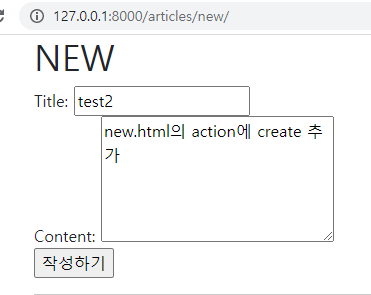 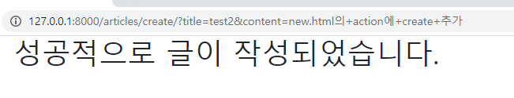 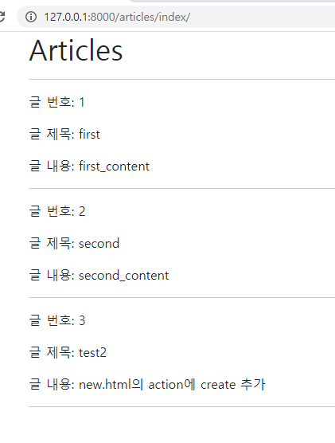

작성하기 누르면 create.html로 이동하고 index에도 새로운 게시글 반영 완료


**게시글 정렬 순서 변경**

- `#1` - DB로 부터 받은 쿼리셋을 이후에 파이썬이 변경 (Python이 조작)
- `#2`-  처음부터 내림차순 쿼리셋으로 받음 (DB가 조작)

```python
# articles/views.py

def index(request):
    # 1. articles = Article.objects.all()[::-1]
    # 2. articles = Artile.objects.order_by('-pk')  
```

 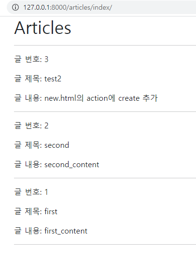

***근데 굳이 게시글을 작성하고 성공적으로 글이 작성되었습니다 라는 페이지가 있어야하나???***

| get                                                      | post                                           |
| -------------------------------------------------------- | ---------------------------------------------- |
| 가져오다 (내놔)                                          | 작성하다( 게시하다)                            |
| DB의 상태는 바꾸지 않음                                  | DB의 상태를 바꾼다.<br />(글 생성, 수정, 삭제) |
| 필요한 데이터는 URL에 담는다.<br />(쿼리스트링/파라미터) | 필요한 데이터는 HTTP Body에 담는다.            |


### Http Method - POST

> https://developer.mozilla.org/ko/docs/Web/HTTP/Methods/POST

- **3가지 이유에서 우리는 글을 작성할 때 GET 요청이 아닌 POST 요청을 해야 한다.**

1. 사용자는 Django에게 '**HTML 파일 줘(GET)**' 가 아니라 '**~한 레코드(글)을 생성해(POST)**' 이기 때문에 GET보다는 POST 요청이 맞다.

2. 데이터는 URL에 직접 노출되면 안된다. (우리가 주소창으로 접근하는 방식은 모두 GET 요청) query의 형태를 통해 DB schema를 유추할 수 있다.

3. 모델(DB)을 건드리는 친구는 GET이 아닌 POST 요청! 왜? 중요하니까 **최소한의 신원 확인**이 필요하다!


**POST**

- 서버로 데이터를 전송할 때 사용
- 서버에 변경사항을 만듦
  - 때문에 요청자에 대한 최소한의 검증을 하지 않으면 부작용을 일으킬 수 있음
  - `csrf_token`을 통해서 요청자의 최소한의 신원확인
- 리소스를 생성/변경하기 위해 데이터를 HTTP body에 담아 전송
- CRUD에서 C/U/D 역할을 담당

<br>

**`GET`**

- 특정 리소스를 가져오도록 요청할 때 사용
- 반드시 데이터를 가져올 때만 사용해야 함
- DB에 변화를 주지 않음
- CRUD에서 R 역할을 담당


**DB 조작(GET/POST)**

- GET 요청은 DB에서 데이터를 꺼내서 가져온다. 즉, DB에 변화를 주는 게 아니다.

  - 즉, **GET**은 누가 요청해도 어차피 정보를 조회(HTML 파일을 얻는 것)하기 때문에 문제가 되지 않음.

- POST 요청은 DB에 조작(생성/수정/삭제)를 하는 것(디비에 변화를 준다)

  - **POST**는 DB에 조작이 가해지기 때문에 요청자에 대한 최소한의 검증을 하지 않으면 아무나 DB에 접근해서 데이터에 조작을 가할 수 있다.

  - `csrf_token`을 통해서 요청자의 최소한의 신원확인을 한다.

    **``**


**`new.html` 수정**

```django
<!-- templates/articles/new.html -->
이건 게시글을 조회하는게 아니라 생성하는거 즉, DB의 상태를 바꾸기 때문에 POST임.

  <form action="" method="POST"> <- POST 바꾸기
  	
```

```PYTHON
# articles/views.py

def create(request):
    title = request.POST.get('title') 
    content = request.POST.get('content')
    
    article = Article(title=title, content=content)
    article.save()
    
    return render(request, 'articles/create.html')
```

**게시글 작성 후 index 페이지로 되돌리기**

```python
# articles/views.py

def create(request):
    ...
    return render(request, 'articles/index.html')
```

- 문제점 발생

  1. 글을 작성 후 index 페이지가 출력되지만 **게시글이 조회되지 않음**

  2. URL은 여전이 create에 머물러 있음

     - 단순히 index 페이지만 render 되었을 뿐이고 url이 돌아가지 못했기 때문

     - create가 끝나면 'articles'의 index로 주소가 돌아가는 작업이 필요.

       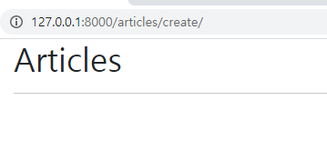 

***우리가 원하는건 글 작성이 끝나면 메인으로 보내기 = index 함수 실행*** 

실행이 되려면 사용자가 '/articles/'라는 주소로 요청을 보내야함.


### Redirect = 다른 주소로 보내다.

* create가 끝나면 'articles'라는 주소로 보낼거임

- POST 요청은 HTML 문서를 렌더링 하는 것이 아니라 **'~~ 좀 처리해줘(요청)'의 의미이기 때문에 요청을 처리하고 나서의 요청의 결과를 보기 위한 페이지로 바로 넘겨주는 것이 일반적**이다.

  ```python
  # articles/views.py
  
  from django.shortcuts import render, redirect <- 얘 추가해주고
  
  
  def create(request):
      title = request.POST.get('title') 
      content = request.POST.get('content')
      
      article = Article(title=title, content=content)
      article.save()
      
      # DB에 데이터 넣었으니까 /articles/create 라는 주소에 머무르지말고.
      # 문서를 보여주는 index페이지로 가자!
      return redirect('articles:index')
  ```

  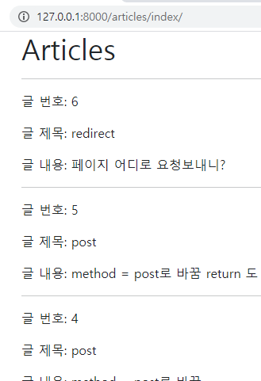 

  

**POST 요청으로 변경 후 변화하는 것**

- POST 요청을 하게 되면 form을 통해 전송한 데이터를 받을 때도 `request.POST.get()` 로 받아야 함
- 글이 작성되면 실제로 **주소 창에 내가 넘긴 데이터가 나타나지 않는다.** (POST 요청은 HTTP body에 데이터를 전송함)
- POST는 html을 요청하는 것이 아니기 때문에 html 파일을 받아볼 수 있는 곳으로 다시 redirect 한다.


## DETAIL - 상세페이지

**urls 설정**

- 개별 게시글 상세 페이지
- 글의 번호(pk)를 활용해서 각각의 페이지를 따로 구현해야 함
- 무엇을 활용할 수 있을까? → Variable Routing

```python
# articles/urls.py

path('<int:pk>/', views.detail, name='detail'),
```


**views 설정**

```python
# articles/views.py

def detail(request, pk):
    article = Article.objects.get(pk=pk)
    context = {
        'article': article,
    }
    return render(request, 'articles/detail.html', context)
```


**templates 설정**

```django
<!-- templates/articles/detail.html -->




  <h2>DETAIL</h2>
  <h3>{{ article.pk }} 번째 글</h3>
  <hr>
  <p>제목: {{ article.title }}</p>
  <p>내용: {{ article.content }}</p>
  <p>작성 시각: {{ article.created_at }}</p>
  <p>수정 시각: {{ article.updated_at }}</p>
  <hr>
  <a href="">[back]</a>

```

- index 페이지에 게시글별 detail 링크작성

  ```django
  <!-- templates/articles/index.html -->
  
  
  
  
  <h1 class="text-center">Articles</h1>
  <a href="">[new]</a> - 생성하기
  <hr>
  
    <p>글 번호: {{ article.pk }}</p>
    <p>글 제목: {{ article.title }}</p>
    <p>글 내용: {{ article.content }}</p>
    **<a href="">[detail]</a>** - 상세정보 보기 버튼
    <hr>
  
  
  ```

  ​	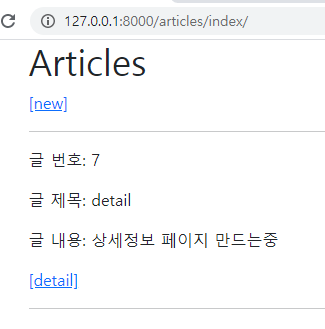

​	지금은 생성하고 index 페이지로감;; 상세 페이지로 들어가고싶다.

**create 후 detail로 이동**

```python
# articles/views.py

def create(request):
    title = request.POST.get('title')
    content = request.POST.get('content')

    article = Article(title=title, content=content)
    article.save()
    
    return redirect('articles:detail', article.pk)
```


## DELETE

게시글 삭제하면 메인페이지로 보내기

**urls 설정**

```python
# articles/urls.py

path('<int:pk>/delete/', views.delete, name='delete'),
```


**views 설정**

```python
# articles/views.py

def delete(request, pk):
    article = Article.objects.get(pk=pk)
    article.delete()
    return redirect('articles:index')
```


**templates 설정**

get 요청으로 보내면 주소창에 delete 만 쓰면 다 지워저버리니까 위험해서 post 방식으로 가야한다. 근데 a태그는 기본적으로 get 요청이기 때문에 적절하지 않음. 

따라서 form태그 사용한다.

```django
<!-- articles/detail.html -->




  ...
  <form action="" method="POST">
    
    <button class="btn btn-danger">DELETE</button>
  </form><br>
  <a href="">[back]</a>

```

- 그래서 POST 로 요청을 받기 위해 다음과 같이 조건을 만든다.

- POST 일때만 삭제되게하기

  ```python
  # articles/views.py
  
  def delete(request, pk):
      article = Article.objects.get(pk=pk)
      if request.method == 'POST':
          article.delete()
          return redirect('articles:index')
      else:
          return redirect('articles:detail', article.pk)
  ```


## UPDATE

1. 게시글 상세 페이지 들어간다
2. 게시글 하단에 있는 '수정'버튼 누른다.
3. 게시글 수정 페이지가 뜬다.
4. 내용을 바꾸고 수정완료 버튼을 누른다
5. 게시글 상세 페이지로 돌아간다.

--> 함수1  : [GET] 수정 페이지 보여주기

--> 함수2 : [POST] 수정데이터를 받아서 DB에 반영한 뒤 게시글 상세 페이지로  redirect

* [GET] /articles/5/edit/ : 수정 페이지 보여줘
* [POST] /articles/5/update : 데이터 줄테니까 DB에 반영해줘 (페이지 필요 없어)


### Edit

**urls 설정**

```python
# articles/urls.py

path('<int:pk>/edit/', views.edit, name='edit'),
```


**views 설정**

```python
# articles/views.py

def edit(request, pk):
    article = Article.objects.get(pk=pk)
    context = {
        'article': article,
    }
    return render(request, 'articles/edit.html', context)
```


**templates 설정**

- 수정은 기존에 입력 되어 있던 데이터를 보여주는 것이 좋기 때문에 html 태그의 `value` 속성을 사용

```django
<!-- articles/edit.html -->




  <h1 class="text-center">EDIT</h1>
  <form action="#" method="POST">
    
    <label for="title">Title: </label>
    <input type="text" name="title" value="{{ article.title }}"><br>
    <label for="content">Content: </label>
    <textarea name="content" cols="30" rows="5">{{ article.content }}</textarea><br>
    <input type="submit">
  </form>
  <hr>
  <a href="">[back]</a>

```

- `detail.html` 에 edit 으로 가는 링크 작성

  ```django
  <!-- articles/detail.html -->
  
  
  
  
    ...
  	이건 페이지 그냥 보여달라는 버튼 만들기니까 method가 GET 그니까 에이태그쓰기
    <a href="" class="btn btn-primary">EDIT</a><br>
    <form action="" method="POST">
      
      <button class="btn btn-danger">DELETE</button>
    </form><br>
  
  	
    <a href="">[back]</a>
  
  ```


### Update

**urls 설정**

```python
# articles/urls.py

path('<int:pk>/update/', views.update, name='update'),
```


**views 설정**

```python
# articles/views.py

def update(request, pk):
    # 수정할 게시ㅐ글 불러오기
    article = Article.objects.get(pk=pk)
    # 수정하는 로직이니까 post로 보내면서 사용자가 건네준 데이터 추출
    article.title = request.POST.get('title')
    article.content = request.POST.get('content')
    article.save()
    # 수정끝났으니까 니가 원래있던 상세페이지로 고고
    return redirect('articles:detail', article.pk)
```

```django
<!-- articles/edit.html -->




  <h1>EDIT</h1>
  <form action="" method="POST">
    
    ...
  <a href="">[back]</a>

```

