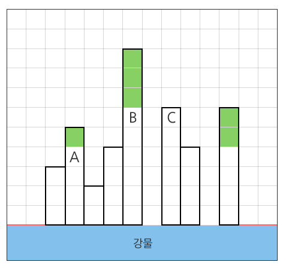
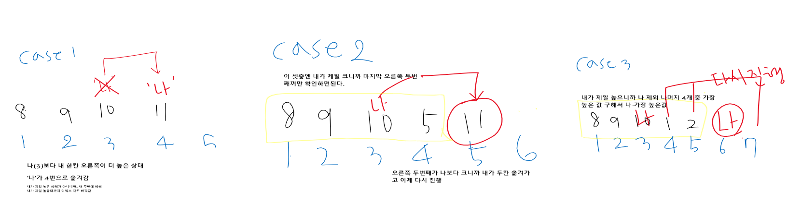

# 1206 View

* **문제조건**

  * 강변에 빌딩들이 옆으로 빽빽하게 밀집한 지역이 있다. 이곳에서는 빌딩들이 너무 좌우로 밀집하여, 강에 대한 조망은 모든 세대에서 좋지만 왼쪽 또는 오른쪽 창문을 열었을 때 바로 앞에 옆 건물이 보이는 경우가 허다하였다.

    그래서 이 지역에서는 왼쪽과 오른쪽으로 창문을 열었을 때, **양쪽 모두 거리 2 이상의 공간이 확보될 때 **조망권이 확보된다고 말한다.

  * 빌딩들에 대한 정보가 주어질 때, 조망권이 확보된 세대의 수를 반환하는 프로그램을 작성하시오.

    아래와 같이 강변에 8채의 빌딩이 있을 때, 연두색으로 색칠된 여섯 세대에서는 좌우로 2칸 이상의 공백이 존재하므로 조망권이 확보된다. 따라서 답은 6이 된다.

     

  * A와 B로 표시된 세대의 경우는 왼쪽 조망은 2칸 이상 확보가 되었지만 오른쪽 조망은 한 칸 밖에 확보가 되지 않으므로 조망권을 확보하지 못하였다.

    C의 경우는 반대로 오른쪽 조망은 2칸이 확보가 되었지만 왼쪽 조망이 한 칸 밖에 확보되지 않았다.

    **[제약 사항]**

    가로 길이는 항상 1000이하로 주어진다.

    맨 왼쪽 두 칸과 맨 오른쪽 두 칸에는 건물이 지어지지 않는다. (예시에서 빨간색 땅 부분)

    각 빌딩의 높이는 최대 255이다.

* **Input**

  * 입력 파일의 첫 번째 줄에는 테스트케이스의 길이가 주어진다. 그 바로 다음 줄에 테스트 케이스가 주어진다.
  * 총 10개의 테스트케이스가 주어진다.

  ```
  100
  0 0 225 214 82 73 241 233 179 219 135 62 36 13 6 71 179 77 67 139 31 90 9 37 ...
  1000
  0 0 225 214 82 73 241 233 179 219 135 62 36 13 6 71 179 77 67 139 31 90 9 37 ...
  ..
  ```

* **Output**

  ```
  #1 691
  #2 9092
  ...
  ```

---

* **Idea**
  
  1. 내 양 옆을 기준으로 나의 진행방향은 오른쪽이니까 우선 왼쪽 두개랑 오른쪽 하나를 비교해서 나보다 큰게 있으면 그 다음 빌딩으로 기준을 옮긴다. (if)
  
  2. 그러나 나를 기준으로 앞에서 본 3개보다 기준인 '나'가 제일 크지만 내 오른쪽 두번째에 있는게 나보다 크면 오른쪽으로 한칸 이동해서 또 그 건물을 확인할 필요 없이 바로 두칸을 뛰어서 그 두번째 꺼를 새로운 ''나'가 되게끔. (elif)
  
  3. 만약 그것도 아니면 (else) 조망권이 확보된 상태이므로 오른쪽 두개 더 볼 필요없이 그냥 3칸 옆으로 뛰어서 새로운 기준 만들기.
  
     

---

* **Code**

  ```python
  import sys
  sys.stdin = open("input.txt")
  
  T = 2
  # 가장 높은 층수 찾기
  def max_height_func(a,b):
      if a > b:
          return a
      else:
          return b
  
  for tc in range(1, T+1):
      # 빌딩 수
      n = int(input())
      # 빌딩의 높이
      height = list(map(int, input().split()))
      # 조망권 확보 수
      cnt = 0
  
      #확인 위치 양쪽 두개 비어있으니까 2부터 시작.
      i = 2
      # 마찬가지로 오른쪽 2개 비어있으므로 비교 안해줘도 됨.
      # 왼쪽에 있는 것들보다 작으면 idx 한 칸 이동, 한 칸 오른쪽 옆에 있는 빌딩보다 작으면 한 칸 이동
      while i < n-2:
          # 1. 바로 왼쪽에 있는 것들보다 작으면 다음 빌딩 확인하기
          # 2. 바로 오른쪽에 있는 것보다 작으면 다음 빌딩 확인
          if height[i-2] >= height[i] or height[i-1] >= height[i] or height[i] < height [i+1]:
              i += 1
  
          # 두 칸 오른쪽 옆에 있는 빌딩보다 작으면 두 칸 이동
          elif height[i] <= height[i + 2]:
              i += 2
          # 조망권 확보
          else:
              # 양 옆의 4개 비교해서 가장 높은 층수 찾기
              max_height = max_height_func(height[i - 2], max_height_func(height[i - 1], max_height_func(height[i + 1], height[i + 2])))
              # 조망권 확보 숫자 더하기
              cnt += height[i] - max_height
              # 바로 3칸 옆으로 뛰기
              i += 3
  
      print("#{} {}".format(tc, cnt))
  ```

---

* **review**
  * 어찌저찌 코드를 짜긴했는데 익숙해지기까지는 아직 시간이 더 필요할거같다
  * 연습하기...

