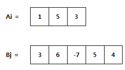

# 1959 두개의 숫자열

* **문제조건**

  * N 개의 숫자로 구성된 숫자열 Ai (i=1~N) 와 M 개의 숫자로 구성된 숫자열 Bj (j=1~M) 가 있다.

    아래는 N =3 인 Ai 와 M = 5 인 Bj 의 예이다.

    ​	

  * Ai 나 Bj 를 자유롭게 움직여서 숫자들이 서로 마주보는 위치를 변경할 수 있다.

    단, 더 긴 쪽의 양끝을 벗어나서는 안 된다.

  * 서로 마주보는 숫자들을 곱한 뒤 모두 더할 때 최댓값을 구하라.

    위 예제의 정답은 아래와 같이 30 이 된다.

     

    **[제약 사항]**

    N 과 M은 3 이상 20 이하이다.

    

* **Input**

  * 가장 첫 줄에는 테스트 케이스의 개수 T가 주어지고, 그 아래로 각 테스트 케이스가 주어진다.

    각 테스트 케이스의 첫 번째 줄에 N 과 M 이 주어지고,

    두 번째 줄에는 Ai, 세 번째 줄에는 Bj 가 주어진다.

  ```
  10
  3 5
  1 5 3
  3 6 -7 5 4
  7 6
  6 0 5 5 -1 1 6
  -4 1 8 7 -9 3
  ...
  ```

* **Output**

  ```
  #1 30
  #2 63
  ...
  ```

---

* **Idea**
  1. 들어오는 N과 M을 보았을 때 항상 N이 작은 것이 아니므로 N이 작을때와 M이 작을 때 두개의 케이스로 나눠준다. 
  2. 작은 곳의 인덱스는 바뀌지 않고 긴쪽의 인덱스가 작은것의 길이만큼 범위를 잡고 한칸씩 옆으로 이동하면서 계산해 결과값을 반환한다.

---

* **Code**

  ```python
  import sys
  sys.stdin = open("input.txt")
  
  T = int(input())
  
  for tc in range(1, T+1):
      tot_sum = []
      # N,M 개의 숫자
      # N개의 숫자로 이루어진 A_list
      # M개의 숫자로 이루어진 B_list
      N, M = map(int, input().split())
      A_list = list(map(int, input().split()))
      B_list = list(map(int, input().split()))
  
      # 갯수가 큰 리스트의 인데스가 바뀌면서 계산해야하므로 두개의 케이스로 나눠서 진행
      for i in range(abs(N-M)+1):
          res = 0
          '''
          B_list가 더 클 경우  A_list의 인덱스는 가만히 있고 B_list의 인덱스를 바꿔가면서 진행
          예를들어
          012
          01234
          (012,012)(012,123)(012,234)
          '''
          if M > N:
              for j in range((N)):
                  res += A_list[j] * B_list[i+j]
              tot_sum.append(res)
          else:
              for j in range((M)):
                  res += A_list[i+j] *  B_list[j]
              tot_sum.append(res)
  
      max_val = tot_sum[0]
      for ele in tot_sum:
          if ele > max_val:
              max_val = ele
  
      print("#{} {}".format(tc, max_val))
  ```

---

* **review**
  
  * 이 문제는 비교적 어려운건 없었고 좀 비슷한 작업이 계속 이루어질때는 그냥 함수로 만들어서 처리할까? 싶기도한데 우선 익숙해지면 점점 바꿔나가보는걸로
  
    ```python
    import sys
    sys.stdin = open("input.txt")
    
    T = int(input())
    
    def func_test(list_small, list_large):
        res = []
        for i in range(len(list_large)-len(list_small)+1):
            tot = 0
            for j in range(len(list_small)):
                tot += list_small[j] * list_large[i+j]
            res.append(tot)
        return max(res)
    
    for tc in range(1, T+1):
        N, M = map(int, input().split())
        a_list = list(map(int, input().split()))
        b_list = list(map(int, input().split()))
    
        if M > N:
            tt = func_test(a_list, b_list)
        else:
            tt = func_test(b_list, a_list)
        print("#{} {}".format(tc, tt))
    
    ```
  
    