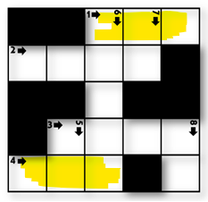

# 1979 어디에 단어가 들어갈 수 있을까

* **문제조건**

  * N X N 크기의 단어 퍼즐을 만들려고 한다. 입력으로 단어 퍼즐의 모양이 주어진다.

  * 주어진 퍼즐 모양에서 특정 길이 K를 갖는 단어가 들어갈 수 있는 자리의 수를 출력하는 프로그램을 작성하라

  * N = 5, K = 3 이고, 퍼즐의 모양이 아래 그림과 같이 주어졌을 때 길이가 3 인 단어가 들어갈 수 있는 자리는 2 곳(가로 1번, 가로 4번)이 된다.

     

    **[제약 사항]**

    1. N은 5 이상 15 이하의 정수이다. (5 ≤ N ≤ 15)

    2. K는 2 이상 N 이하의 정수이다. (2 ≤ K ≤ N)

* **Input**

  * 입력은 첫 줄에 총 테스트 케이스의 개수 T가 온다.

  * 테스트 케이스의 첫 번째 줄에는 단어 퍼즐의 가로, 세로 길이 N 과, 단어의 길이 K 가 주어진다.

  * 퍼즐의 각 셀 중, 흰색 부분은 1, 검은색 부분은 0 으로 주어진다.

     = 들어갈 수 있는 부분이 1로 표현됨.

  ```
  10
  5 3
  0 0 1 1 1
  1 1 1 1 0
  0 0 1 0 0
  0 1 1 1 1
  1 1 1 0 1
  5 3
  1 0 0 1 0
  1 1 0 1 1
  1 0 1 1 1
  0 1 1 0 1
  0 1 1 1 0
  …
  ```

* **Output**

  ```
  #1 2
  #2 6
  ...
  ```

---

* **Idea**

  1. 우선 이차원 리스트로 만든 다음에 행으로 접근, 열로 접근 두가지 경우의 for문이 만들어 져야한다.

  2.  행으로 도는 경우만 대표적으로 말하자면 1의 갯수를 세어줄 cnt 변수를 하나 만들어주고

     0을 만나면 cnt 다시 0으로 초기화.

     그런데 0으로 초기화 하기전에 cnt값을 봐서 얘가 3이면 최종 결과를 저장해주는 res에 +1 해주고 다시 cnt는 0으로. (01110 이런거 대비)

     (011111) 이런거에는 못들어가니까 cnt==3이면 res +1 해주는 코드도 추가

---

* **Code**

  ```python
  import sys
  sys.stdin = open("input.txt")
  
  T = int(input())
  
  for tc in range(1, T+1):
      n, k = map(int, input().split())
      # 이차원 배열 만들기
      res = []
      for _ in range(n):
          res.append(list(map(int, input().split())))
  
      # 들어갈 수 있는 곳 : 1, 못들어감 : 0
      # 전체 들어갈 수 있는 갯수
      ans = 0
  
      # 가로축 찾기
      for row in range(n):
          # k개에 딱 맞는 1의 개수 구하기
          cnt = 0
          for col in range(n):
              # 1을 만나면 cnt 1씩 증가
              if res[row][col] == 1:
                  cnt += 1
              # 0을 만나면
              else:
                  # 만약 01110 이고 k가 3이었을 경우 위의 조건문에서 cnt가 3이 되고 들어갈 수 있으므로 최종 결과값에 +1을 해준 뒤
                  if cnt == k:
                      ans += 1
                  # 0을 만났으므로 다시 cnt 초기화
                  cnt = 0
          # 한 행에 대해 모든 열을 다 보았을 때 cnt가 k이면 최종 결과 값에 +1
          if cnt == k:
              ans += 1
  
      # 세로축에서 찾기 위의 방법과 동일
      for col in range(n):
          cnt = 0
          for row in range(n):
              if res[row][col] == 1:
                  cnt += 1
              else:
                  if cnt == k:
                      ans += 1
                  cnt = 0
          if cnt == k:
              ans += 1
  
      
      print("#{} {}".format(tc, ans))
  ```

---

* **review**
  * 아 생각보다 어렵네;;

