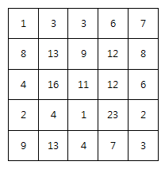
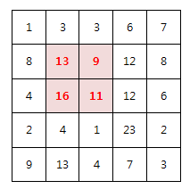

# 2001 파리퇴치

* **문제조건**

  * N x N 배열 안의 숫자는 해당 영역에 존재하는 파리의 개수를 의미한다.

    아래는 N=5 의 예이다.

     

  * M x M 크기의 파리채를 한 번 내리쳐 최대한 많은 파리를 죽이고자 한다.

    **죽은 파리의 개수**를 구하라!

    예를 들어 M=2 일 경우 위 예제의 정답은 49마리가 된다.

     

    **[제약 사항]**

    1. N 은 5 이상 15 이하이다.

    2. M은 2 이상 N 이하이다.

    3. 각 영역의 파리 갯수는 30 이하 이다.

* **Input**

  * 가장 첫 줄에는 테스트 케이스의 개수 T가 주어지고, 그 아래로 각 테스트 케이스가 주어진다.

    각 테스트 케이스의 첫 번째 줄에 N 과 M 이 주어지고,

    다음 N 줄에 걸쳐 N x N 배열이 주어진다.

  ```
  10
  5 2
  1 3 3 6 7
  8 13 9 12 8
  4 16 11 12 6
  2 4 1 23 2
  9 13 4 7 3
  6 3
  29 21 26 9 5 8
  21 19 8 0 21 19
  9 24 2 11 4 24
  19 29 1 0 21 19
  10 29 6 18 4 3
  29 11 15 3 3 29
  ...
  ```

* **Output**

  ```
  #1 49
  #2 159
  ...
  ```

---

* **Idea**
  1. 이충 반복문으로 이차원 배열을 하나 만들어 놓고 
  2. 슬라이싱??

---

* **Code**

  ```python
  import sys
  sys.stdin = open("input.txt")
  
  T = int(input())
  
  for tc in range(1, T+1):
      n,m = map(int, input().split())
      box = []
      res = 0
      # 이차원 배열 만들기
      for i in range(n):
          box.append(list(map(int, input().split())))
      # 전체 박스 접근
      for row in range(n-m+1):
          for col in range(n-m+1): # 정사각형이니까 범위 똑같이
              hit = 0
              # 파리채 부분 m*m 접근
              for k in range(m):
                  for l in range(m):
                      # 오른쪽으로 이동히면서 보는 느낌?
                      hit += box[row+k][col+l]
              if res < hit:
                  res = hit
  
      print("#{} {}".format(tc,res ))
  
  ```

---

* **review**

  * 예전같으면 hit의 값을 새로운 리스트에 다 넣고 마지막 큰 값을 찾을 때 그 리스트를 다 도는 방법을 사용했을텐데 다른분들의 코드를 보니까 한 반복문이 끝날 때 마다 그 값을 실시간으로 반영시키는 방법을 쓰셨는데 그게 더 좋을거같아서 저 방법이 익숙해지도록 많이 써봐야겠다.

  * 그다음 이차원 배열이 만들어지면 우선 크게 두번의 반복된 작업이 수행된다. 첫번째는 파리채에 해당하는 정사각형 부분을 다 더해줘야하기 때문에 그 파리채에 해당하는 이차원 배열에 접근하는 반복문이 있어야 하므로 두개의 반복문이 필요하고

    그 다음에 전체의 이차원 배열에서 또 파리채부분이 옮겨가는 행동이 필요하다 그러기 위해서는 가로 세로 모두 (N-M+1) * (N-M+1)이 작업이 수행되어야하므로 또 두개의 반복문이 필요하므로

    이 문제에서는 4개의 반복문이 한꺼번에 적히면서 접근을 해야한다.

