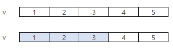
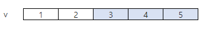

# 4835 구간합

* **문제조건**

  * N개의 정수가 들어있는 배열에서 이웃한 M개의 합을 계산하는 것은 디지털 필터링의 기초연산이다.

  * M개의 합이 가장 큰 경우와 가장 작은 경우의 차이를 출력하는 프로그램을 작성하시오.

  * 다음은 N=5, M=3이고 5개의 숫자 1 2 3 4 5가 배열 v에 들어있는 경우이다.
     
    이웃한 M개의 합이 가장 작은 경우 1 + 2 + 3 = 6

     
    
    
    이웃한 M개의 합이 가장 큰 경우 3 + 4 + 5 = 12
    
    답은 12와 6의 차인 6을 출력한다.
  
* **Input**

  * 첫 줄에 테스트 케이스 개수 T가 주어진다. ( 1 ≤ T ≤ 50 )

  * 다음 줄부터 테스트케이스의 첫 줄에 정수의 개수 N과 구간의 개수 M 주어진다. 

    ( 10 ≤ N ≤ 100, 2 ≤ M ＜ N )

  * 다음 줄에 N개의 정수 ai가 주어진다. ( 1 ≤ a ≤ 10000 )

  ```
  3
  10 3
  1 2 3 4 5 6 7 8 9 10
  10 5
  6262 6004 1801 7660 7919 1280 525 9798 5134 1821
  20 19
  3266 9419 3087 9001 9321 1341 7379 6236 5795 8910 2990 2152 2249 4059 1394 6871 4911 3648 1969 2176	 
  ```

* **Output**

  * 각 줄마다 "#T" (T는 테스트 케이스 번호)를 출력한 뒤, 답을 출력한다.

  ```
  #1 21
  #2 11088
  #3 1090
  ```

---

* **Idea**
  1. 슬라이싱 하면서 만들어지는 합을 담을 리스트를 하나 만들어준다.
  2. 슬라이싱을 하면서 나온 합을 리스트에 넣어주고
  3. 리스트안에서 최대 최소값 정해서 결과값 반환

---

* **Code**

  ```python
  T = int(input())
  for tc in range(1, T+1):
      # N : N개의 정수
      # M : M개 선택하기
      N, M = map(int, input().split())
      numbers = list(map(int, input().split()))
  
      res_lst = []
      # N-M+1만큼 반복문을 도는 작업이 필요하다.
      for i in range(N-M+1):
          res = 0
          for j in range(M):
              res += numbers[i+j]
          res_lst.append(res)
  
      max_val = res_lst[0]
      for res_ele in res_lst:
         if res_ele >  max_val:
             max_val = res_ele
  
      min_val = res_lst[0]
      for res_ele in res_lst:
          if res_ele < min_val:
              min_val = res_ele
  
  
      print("#{} {}".format(tc,max_val- min_val))
  ```

---

* **review**

  * ``res = 0``이걸 for문 밖에서 정의해줘서 계속 더해지는 현상 발생 ;;; 

    자리 잘 지키기 !! ㅠㅠ 제발 대충 이거겠지? 이게 아니라 한번에 정확하게 생각좀 ㅜㅜ

  * 리스트에 추가 안하고 그냥 바로 for문안에서 비교하는법 없나? 다시짜서 추가하기

