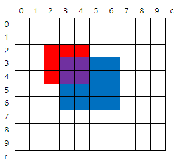

# 4836 색칠하기

* **문제조건**

  * 그림과 같이 인덱스가 있는 10x10 격자에 빨간색과 파란색을 칠하려고 한다.

    N개의 영역에 대해 왼쪽 위와 오른쪽 아래 모서리 인덱스, 칠할 색상이 주어질 때, 칠이 끝난 후 색이 겹쳐 보라색이 된 칸 수를 구하는 프로그램을 만드시오.

    **주어진 정보에서 같은 색인 영역은 겹치지 않는다.**

     

  * 예를 들어 2개의 색칠 영역을 갖는 위 그림에 대한 색칠 정보이다.

    2

    2 2 4 4 1 ( [2,2] 부터 [4,4] 까지 color 1 (빨강) 으로 칠한다 )

    3 3 6 6 2 ( [3,3] 부터 [6,6] 까지 color 2 (파랑) 으로 칠한다 )

* **Input**

  * 첫 줄에 테스트 케이스 개수 T가 주어진다.  ( 1 ≤ T ≤ 50 )

    다음 줄부터 테스트케이스의 첫 줄에 칠할 영역의 개수 N이 주어진다. ( 2 ≤ N ≤ 30 )

    다음 줄에 왼쪽 위 모서리 인덱스 r1, c1, 오른쪽 아래 모서리 r2, c2와 색상 정보 color가 주어진다. ( 0 ≤ r1, c1, r2, c2 ≤ 9 )

    color = 1 (빨강), color = 2 (파랑)

  ```
  3
  2
  2 2 4 4 1
  3 3 6 6 2
  3
  1 2 3 3 1
  3 6 6 8 1
  2 3 5 6 2
  3
  1 4 8 5 1
  1 8 3 9 1
  3 2 5 8 2
  ```

* **Output**

  ```
  #1 4
  #2 5
  #3 7
  ```

---

* **Idea**
  1. 빨간색에 해당하는 부분을 다 칠하고
  2. 파란색에 해당하는 부분을 다 칠한다음에
  3. 합해진 값이 3 인 부분의 갯수를 세어본다.

---

* **Code**

  ```python
  import sys
  sys.stdin = open("input.txt")
  
  T = int(input())
  
  for tc in range(1, T+1):
      n = int(input())
      # 10*10 mat.
      arr = [[0 for _ in range(10)] for _ in range(10)]
  
      for i in range(n):
          # 좌표 받아오기
          x1, y1, x2, y2, color = map(int, input().split())
          # 가로 세로 길이만큼 해당 영역에 색칠해주기
          # 가로 방향으로 색이 칠해지는 중
          for i in range(x2-x1+1):
              for j in range(y2-y1+1):
                  arr[x1+i][y1+j] += color
  
      # 파란색과 빨간색이 같이 칠해져야하므로 빨강 + 파랑 = 3, 빨강 + 빨강 + 파랑일 수도 있으니까 3이상으로 조건식 지정
      cnt = 0
      for i in range(10):
          for j in range(10):
              if arr[i][j] == 3:
                  cnt += 1
  
      print("#{} {}".format(tc, cnt))
  
  ```

---

* **review**
  * 처음에 문제를 잘 안 읽어서 색이 겹쳐서 칠해지면 어떻게하나 계속 생각을 했는데 문제에서 색이 안겹친다고 나와있었다
  * 겹치는거 고려해야하면 난이도 높아질거같은데 어떻게 할지 모르겠다..

